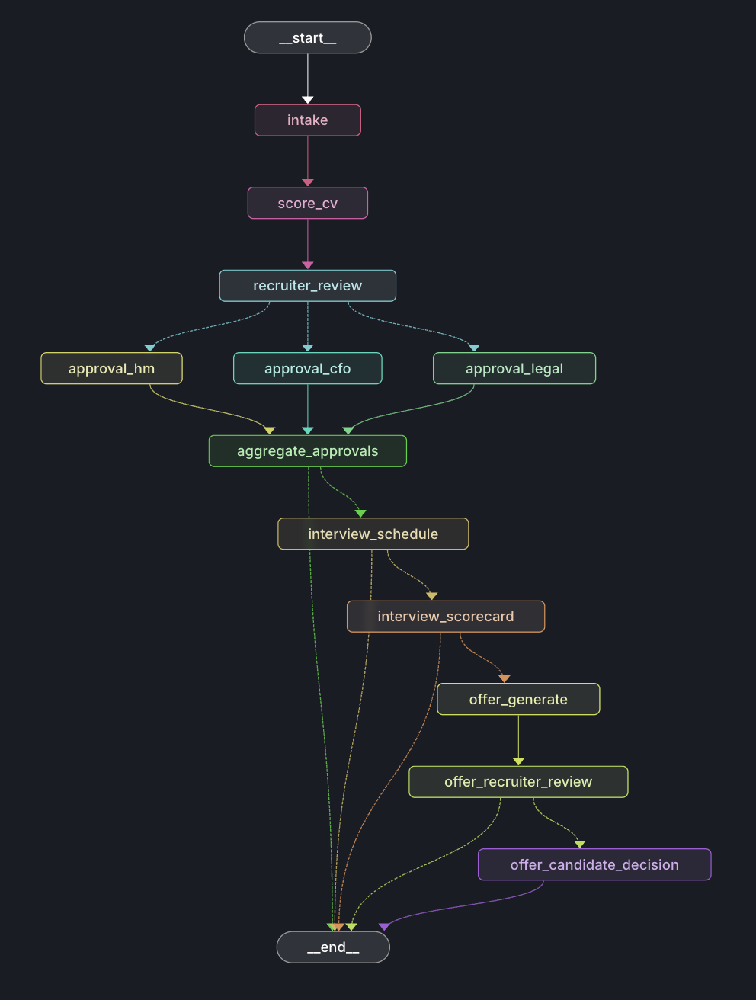

# HR Recruiting AI Agent — Ответ на тестовое задание

> **Репозиторий с реализацией:** [github.com/SergeyStepanenko/hr-lang-graph](https://github.com/SergeyStepanenko/hr-lang-graph)

---

## Оптимальный процесс глазами бизнеса

> *«Опишите, как вы видите оптимальный процесс…»*

До того как обсуждать AI-агента — как должен выглядеть процесс в идеале:

1. **Кандидат подаёт CV** — единая точка входа (форма / email / ATS-интеграция). Никаких «отправь резюме на почту X, а потом продублируй Y».
2. **Быстрая первичная оценка без человека** — AI парсит CV, извлекает контакты, скорит относительно требований конкретной вакансии. Это снимает с recruiter рутину чтения сотен CV.
3. **Recruiter принимает решение по короткой сводке** — не читает всё CV целиком, а видит score, strengths, red_flags и 3–5 предложений summary. Решение — **за человеком**, AI только готовит контекст.
4. **Параллельные апрувы, а не последовательные** — HM (профильное соответствие), CFO (бюджет), Legal (возможность работы в локации) запрашиваются **одновременно**. Любой может заблокировать → процесс останавливается с понятной причиной. Все одобрили → дальше.
5. **Кандидат и интервьюер согласуют интервью** — система отправляет приглашение, ждёт подтверждения, фиксирует scorecard.
6. **Оффер генерируется AI, проверяется recruiter, отправляется кандидату** — никаких «оффер по шаблону руками в Word». Recruiter ревьюит черновик перед отправкой.
7. **Прозрачность на каждом шаге** — кто, когда, по какой причине принял решение. Полный audit trail для HR-аудита и compliance.
8. **Терпимость к задержкам** — если участник не отвечает 3+ дня, система **напоминает**, но **не принимает решение за него**. HR-решения требуют человеческого суждения, автоматический reject из-за тишины недопустим.
9. **Edge cases — не блокеры, а ветки** — CV без email не должен ронять процесс; рестарт сервера не должен терять стейт; параллельные кандидаты на одну вакансию — независимы.

Ниже — как этот процесс ложится на AI-agent flow.

---

## 1. Как я моделирую процессы

> *«Какие этапы выделяете; где есть параллельные действия; где система должна ждать внешний ответ или фидбэк.»*

### Граф процесса

Ниже — реальный граф из **LangGraph Studio** (`langgraph dev`), построенный на основе кода этого проекта. Нагляднее любой ASCII-схемы: видны параллельные ветки апрувов, все точки прерывания и альтернативные пути завершения через `__end__`.

### Этапы процесса

Линейно процесс выглядит так: **кандидат подаёт CV → AI парсит контакты и скорит относительно вакансии → recruiter ревьюит сводку → если ок, параллельно стартуют апрувы HM/CFO/Legal → если все одобрили, согласуется интервью → интервьюер заполняет scorecard → AI генерирует offer draft → recruiter ревьюит → оффер уходит кандидату → кандидат принимает решение**. На любом шаге процесс может уйти в rejection — с автоматической отправкой эмпатичного отказа.

Каждый этап — нода в LangGraph. Автоматические шаги работают без участия человека, шаги с `⏸` — точки `interrupt()`, где граф сериализует стейт и ждёт HTTP-запроса с решением.

| # | Нода | Тип | Участник |
|---|---|---|---|
| 1 | `intake` | Автомат (AI) | — |
| 2 | `score_cv` | Автомат (AI) | — |
| 3 | `recruiter_review` | ⏸ Ожидание | Recruiter |
| 4a | `approval_hm` | ⏸ Параллельно | Hiring Manager |
| 4b | `approval_cfo` | ⏸ Параллельно | CFO |
| 4c | `approval_legal` | ⏸ Параллельно | Legal |
| 5 | `aggregate_approvals` | Автомат | — |
| 6 | `interview_schedule` | ⏸ Ожидание | Candidate |
| 7 | `interview_scorecard` | ⏸ Ожидание | Interviewer |
| 8 | `offer_generate` | Автомат (AI) | — |
| 9 | `offer_recruiter_review` | ⏸ Ожидание | Recruiter |
| 10 | `offer_candidate_decision` | ⏸ Ожидание | Candidate |

### Где есть параллельные действия

Этапы 4a/4b/4c — апрувы HM, CFO и Legal — **запускаются одновременно** через LangGraph `Send()` (fan-out). Каждый ждёт своего `interrupt()` независимо, в любом порядке. Fan-in происходит в `aggregate_approvals`: граф туда попадает только когда все три ветки завершились.

Правило агрегации: **все должны одобрить** → `stage = "interview"`; **любой вето** → rejection email кандидату + `END`.

**Fan-out** — [src/workflow.py:48-70](https://github.com/SergeyStepanenko/hr-lang-graph/blob/9268ed0/src/workflow.py#L48-L70): роутер-функция, которая возвращает список `Send()` — именно здесь граф разветвляется от одного потока на три независимых ветки апрувов. Каждая ветка живёт и ждёт самостоятельно.

**Fan-in** — [src/workflow.py:29-45](https://github.com/SergeyStepanenko/hr-lang-graph/blob/9268ed0/src/workflow.py#L29-L45): поле `approval_results` в `RecruitingState` аннотировано `operator.add` — это reducer, который автоматически накапливает результаты всех трёх веток в один список. Без него каждый следующий апрув перезаписывал бы предыдущий.

### Где система должна ждать внешний ответ

7 точек прерывания — `interrupt()` внутри ноды останавливает граф, сериализует стейт в SQLite, освобождает поток. Граф не «спит» — ждёт HTTP-запроса, который может прийти через часы или недели.

**Как это выглядит в коде** — [src/nodes.py:90-133](https://github.com/SergeyStepanenko/hr-lang-graph/blob/9268ed0/src/nodes.py#L90-L133): нода `recruiter_review` вызывает `interrupt()` — граф мгновенно сериализует весь стейт в SQLite и освобождает поток. Никакого polling, никакого зависшего процесса. Продолжение придёт через отдельный HTTP-запрос — через минуту или через неделю.

Полный список точек ожидания:

| Нода | Кто отвечает | Что система отправила до этого |
|---|---|---|
| `recruiter_review` | Recruiter | Slack: AI score + summary кандидата |
| `approval_hm` | Hiring Manager | Slack: запрос на апрув |
| `approval_cfo` | CFO | Slack: запрос на апрув |
| `approval_legal` | Legal | Slack: запрос на апрув |
| `interview_schedule` | Candidate | Email: приглашение на интервью |
| `interview_scorecard` | Interviewer | Email: подтверждение расписания |
| `offer_recruiter_review` | Recruiter | Slack: "offer draft ready" |
| `offer_candidate_decision` | Candidate | Email: текст оффера |

---

## 2. Как работает агент/flow

> *«Какие шаги автоматизируются полностью; где нужен человек; как агент понимает, что делать дальше; как обрабатываются исключения, задержки и отсутствие ответа.»*

### Что автоматизируется полностью

| Шаг | Что делает AI | Код |
|---|---|---|
| **CV Parsing** | Извлекает name, email, phone, telegram, linkedin из произвольного текста. Structured output → Pydantic `CandidateContact`. Если email не найден → флаг `no_contact`, email-коммуникации с кандидатом отключаются. | [src/llm.py:19-31](https://github.com/SergeyStepanenko/hr-lang-graph/blob/9268ed0/src/llm.py#L19-L31) |
| **CV Scoring** | Оценка 0–100 с reasoning, strengths, red_flags относительно требований конкретной вакансии. Structured output → `CVScore`. | [src/llm.py:34-45](https://github.com/SergeyStepanenko/hr-lang-graph/blob/9268ed0/src/llm.py#L34-L45) |
| **Recruiter Summary** | 3–5 предложений о кандидате для быстрого принятия решения. | [src/llm.py:48-59](https://github.com/SergeyStepanenko/hr-lang-graph/blob/9268ed0/src/llm.py#L48-L59) |
| **Offer Draft** | Персонализированный текст job offer letter — имя кандидата + позиция. | [src/llm.py:62-67](https://github.com/SergeyStepanenko/hr-lang-graph/blob/9268ed0/src/llm.py#L62-L67) |
| **Rejection Email** | Профессиональный эмпатичный отказ с учётом причины. Внутренние формулировки ("too junior") не попадают в текст письма кандидату. | [src/llm.py:70-75](https://github.com/SergeyStepanenko/hr-lang-graph/blob/9268ed0/src/llm.py#L70-L75) |
| **Approval aggregation** | Детерминированная логика без LLM: ALL approved → interview, ANY rejected → veto + rejection. | [src/nodes.py:174-207](https://github.com/SergeyStepanenko/hr-lang-graph/blob/9268ed0/src/nodes.py#L174-L207) |

### Где нужен человек

Каждое бизнес-решение остаётся за человеком. AI только готовит информацию и контекст:

- **Recruiter** — approve/reject кандидата после скрининга; approve offer draft перед отправкой
- **HM / CFO / Legal** — параллельные апрувы (любой может заблокировать)
- **Interviewer** — scorecard с оценкой после интервью
- **Candidate** — подтверждение интервью; accept/reject оффера

Нажатие кнопки Approve/Reject в UI → POST `/action/{candidate_id}` → `resume_workflow()` → `Command(resume={interrupt_id: decision})` → LangGraph продолжает с точного места прерывания.

### Как агент понимает, что делать дальше

**Принципиально: LLM не принимает решений о маршрутизации.** Агент не «думает», что делать следующим — следующий шаг определяется детерминированной функцией от `state["stage"]`. LLM работает только внутри нод и только над контентом (парсинг CV, скоринг, генерация текста оффера/отказа). Это делает поведение графа воспроизводимым, тестируемым и понятным аудиту.

Граф использует **conditional edges** — функции-роутеры, которые читают `state["stage"]` и возвращают имя следующей ноды (или `END`). Единственный источник правды — поле `stage`. Каждая нода возвращает `{"stage": "..."}`, роутер переходит дальше.

**Код роутеров** — [src/workflow.py:73-78](https://github.com/SergeyStepanenko/hr-lang-graph/blob/9268ed0/src/workflow.py#L73-L78): детерминированные функции, которые читают `state["stage"]` и возвращают имя следующей ноды. Нет `if event == "cfo_approved_do_X"`, нет распределённого state machine по всему коду — один граф, одна функция перехода на каждое ребро.

### Как обрабатываются исключения, задержки и отсутствие ответа

#### Задержки и отсутствие ответа — virtual clock + nudge

Вместо реальных таймеров — **virtual clock**: целое число `clock_day` в БД. Кнопка "Skip Time" двигает его вперёд. При каждом `advance()` система проверяет всех активных кандидатов: если `clock_day - last_action_day >= 3` → Slack-напоминание ответственному участнику.

**Принципиально важно**: граф **не принимает автоматических решений при таймауте** — только напоминает. HR-решения требуют человеческого суждения, автоматический reject из-за задержки недопустим.

**Код nudge** — [src/app.py:63-78](https://github.com/SergeyStepanenko/hr-lang-graph/blob/9268ed0/src/app.py#L63-L78): при каждом advance() часов перебирает всех активных кандидатов и отправляет Slack-напоминание если ответа не было 3+ дня. Граф при этом не трогается — система только уведомляет, решение остаётся за человеком. В production virtual clock заменяется реальным cron.

#### Кандидат без email — флаг `no_contact`

Если `parse_cv_contact` не нашёл email → `no_contact = True`. Все `send_email()` для кандидата пропускаются условно. Workflow продолжается полностью — только без email-коммуникаций с кандидатом.

**Код** — [src/nodes.py:38-62](https://github.com/SergeyStepanenko/hr-lang-graph/blob/9268ed0/src/nodes.py#L38-L62): в `intake`-ноде, если парсер не нашёл email, устанавливается флаг `no_contact` и все последующие `send_email()` для кандидата пропускаются условно. Workflow продолжается полностью — edge case не блокирует процесс.

#### Ошибки запуска workflow

`try/except` в `/apply`: если `start_workflow` падает (сеть, API), ошибка пишется в `audit_log`, кандидат сохраняется в БД. **Код** [src/app.py:161-169](https://github.com/SergeyStepanenko/hr-lang-graph/blob/9268ed0/src/app.py#L161-L169).

#### Персистентность после рестарта сервера

`SqliteSaver` как checkpointer: стейт каждого workflow сериализован в `data/checkpoints.db`. Сервер перезапускается — граф продолжает с последней контрольной точки без потери данных. **Код** [src/workflow.py:144-154](https://github.com/SergeyStepanenko/hr-lang-graph/blob/9268ed0/src/workflow.py#L144-L154).

---

## 3. Как я реализовал решение

> *«Можно текстом, схемой, псевдокодом или небольшим кодовым примером; не нужен большой production-ready проект; важнее логика, структура решения и ход мыслей.»*

### Почему LangGraph, а не просто код

Без LangGraph нужно реализовать вручную: персистенцию стейта между HTTP-запросами, механизм паузы/возобновления, fan-out с параллельными ожиданиями, восстановление после рестарта, инспекцию текущего состояния любого workflow. LangGraph даёт всё это из коробки через `interrupt()`, `Send()` и checkpointer.

### Стек

| Компонент | Инструмент | Обоснование |
|---|---|---|
| Оркестрация | **LangGraph** | `interrupt()` для HITL, `Send()` для fan-out/fan-in, `SqliteSaver` для персистенции |
| LLM | **OpenAI gpt-4o-mini** | Structured output через Pydantic, баланс цена/качество для extraction и scoring |
| LLM интеграция | **langchain-openai** | `ChatOpenAI` — LangSmith автоматически видит токены и стоимость каждого вызова |
| Web | **FastAPI + Jinja2 + HTMX** | SSR без SPA-complexity. Process widget polling каждые 5 секунд без перезагрузки |
| БД | **SQLite + SQLModel** | Zero-config, embedded. Две базы: `hr.db` (бизнес-данные) и `checkpoints.db` (LangGraph стейт) |
| Observability | **LangSmith** | Трейсинг всех LLM вызовов, каждый workflow = именованный trace с метаданными |
| Dev tools | **LangGraph Studio** | Визуальный граф (скриншот выше), пошаговое выполнение, инспекция стейта |

### Ключевые фрагменты

#### Параллельный approval с fan-in

[src/nodes.py:148-171](https://github.com/SergeyStepanenko/hr-lang-graph/blob/9268ed0/src/nodes.py#L148-L171) — `_do_approval`: единая нода для всех трёх ролей (HM, CFO, Legal). Вызывает `interrupt()` и добавляет своё решение в `approval_results` через `operator.add` reducer. Благодаря reducer каждая ветка пишет свой результат независимо, без race condition.

[src/nodes.py:174-207](https://github.com/SergeyStepanenko/hr-lang-graph/blob/9268ed0/src/nodes.py#L174-L207) — `aggregate_approvals`: собирает все три результата и применяет правило unanimous — любой `rejected` → veto и rejection email кандидату, все `approved` → переход в `interview`.

#### LLM scoring со structured output

[src/llm.py:34-45](https://github.com/SergeyStepanenko/hr-lang-graph/blob/9268ed0/src/llm.py#L34-L45) + [src/schemas.py:13](https://github.com/SergeyStepanenko/hr-lang-graph/blob/9268ed0/src/schemas.py#L13) — `score_cv` использует `with_structured_output(CVScore)`: модель возвращает не свободный текст, а строго типизированный Pydantic объект с полями `score`, `reasoning`, `strengths`, `red_flags`. Никакого парсинга строк, результат всегда валиден и проверяем.

#### LLM Evals — проверка качества AI-решений

Два слоя: **heuristic** (детерминированные assertions) + **LLM-as-judge** (второй LLM оценивает качество первого).

[tests/test_evals.py:59-68](https://github.com/SergeyStepanenko/hr-lang-graph/blob/9268ed0/tests/test_evals.py#L59-L68) — `llm_judge`: утилита для LLM-as-judge тестирования, где второй LLM проверяет вывод первого, отвечая YES/NO на конкретный вопрос. Позволяет тестировать нюансы, которые регулярным выражением не поймать — например, что rejection email не раскрывает внутренние формулировки типа "too junior" кандидату.

### Прозрачность — полный audit trail

> *«Весь флоу должен быть контролируемым и прозрачным, независимо от того, выполняется ли он автоматически, ожидает наступления события в будущем или требует действий со стороны пользователя.»*

Каждое действие — и автоматическое, и человеческое — пишется в `audit.jsonl` через [src/comms.py:78-113](https://github.com/SergeyStepanenko/hr-lang-graph/blob/9268ed0/src/comms.py#L78-L113): функция `audit_log` записывает actor, event, reasoning и виртуальный день для каждого события (AI-решение, апрув, отказ, отправка письма). Единственный источник правды о том, кто, когда и почему принял решение — полный след для HR-аудита.

